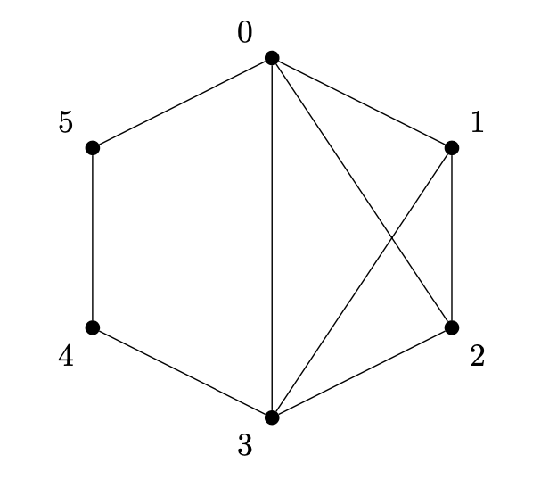
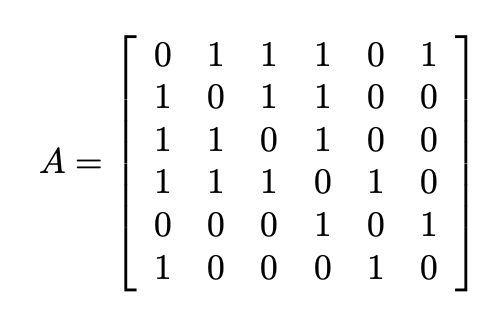
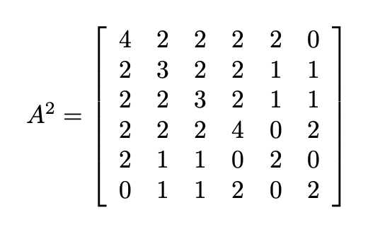

# Searching for a subgraph that is a triangle

 

A **cycle** is a undirected graph in which each vertex has a degree of two. A cycle with $n$ vertices is denoted as $C_n$. On the other hand, a **triangle** is referred to as cycle $C_3$, which is a cycle containing three vertices.

 

## Problem description

The goal is to find a triangle $C_3$ in the undirected graph $G$. For the given graph, potential cycles could be the paths:

* $0 \rightarrow 1 \rightarrow 2 \rightarrow 0$,
* $0 \rightarrow 2 \rightarrow 3 \rightarrow 0$,
* $0 \rightarrow 1 \rightarrow 3 \rightarrow 0$.
* $1 \rightarrow 2 \rightarrow 3 \rightarrow 1$,

One of the methods is to utilize the adjacency matrix raised to the power of $k$. In this case, $A^{k}_{ij} = x$ signifies that there are $x$ distinct paths of length $k$ between vertex $i$ and vertex $j$.

From the adjacency matrix $A^2$, for example, it follows that there are two paths of length $2$ from vertex $0$ to vertex $2$, as reflected in the diagram shown.

If there is a path of length two leading from vertex $i$ to vertex $j$, and if vertices $i$ and $j$ are adjacent, then there exists a subgraph isomorphic to cycle $C_3$. Additionally, assuming the above, if there is a vertex $v$ adjacent to vertices $i$ and $j$, then graph $G$ contains a triangle (cycle $C_3$) $i \rightarrow j \rightarrow v \rightarrow i$.

 

## Solution

There are two approaches to solving this problem. The first one (referred to as naive) involves matrix multiplication using the Gauss-Jordan method and is more commonly used by novice programmers. Unfortunately, the cost of this operation is quite high, as it is $\mathcal{O}(n^3)$. The second approach utilizes more efficient matrix multiplication with the Strassen algorithm, which reduces the computational complexity from $\mathcal{O}(n^3)$ to $\mathcal{O}(n^{\lg{7}}) \approx \mathcal{O}(n^{2,81})$.

