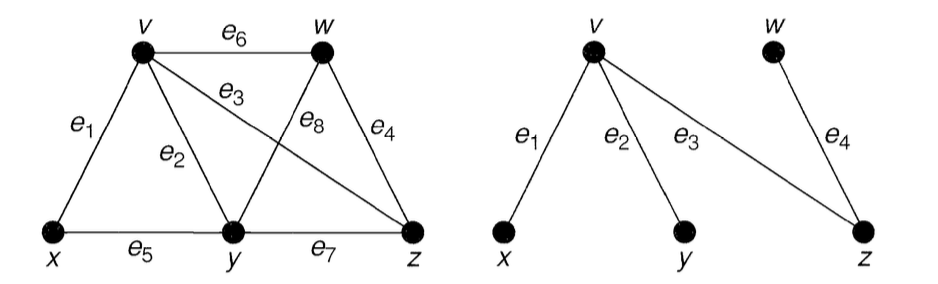

# Searching for a tree in connected graph

<br>

Let $T$ be a graph with $n$ vertices. Then the following statements are equivalent:
1. $T$ is a tree.
2. $T$ contains no cycles, and has $n—1$ edges.
3. $T$ is connected, and has $n-1$ edges.
4. $T$ is connected, and each edge is a bridge.
5. Any two vertices of $T$ are connected by exactly one path.
6. $T$ contains no cycles, but the addition of any new edge creates exactly one cycle.

In simpler terms, **tree** is a graph in which there is exactly one path between any two vertices.

<br>

### Definition of the spanning tree

If we choose any cycle in a connected graph $G$ and remove any of its edges, the resulting graph will still remain connected. We can repeat this procedure with any of the remaining cycles until there are no cycles left in the graph. The tree created in this way is called a **spanning tree** (or a **spanning forest**) of the graph $G$.

## Problem description

The goal is to find a spanning tree $T$ in a simple connected graph $G$. Below, I present graph $G$ and the spanning tree $T$ of graph $G$.



<br>

## Solution

One of the methods is to use the DFS algorithm (Depth-First Search). During the depth-first traversal, we delve as far as possible before looking into other adjacent vertices.

[](https://en.wikipedia.org/wiki/Depth-first_search)

```
procedure DFS(G, v) is
    label v as discovered
    for all directed edges from v to w that are in G.adjacentEdges(v) do
        if vertex w is not labeled as discovered then
            recursively call DFS(G, w)
```

The computational complexity of the DFS algorithm is $\mathcal{O}(|V|+|E|)$.