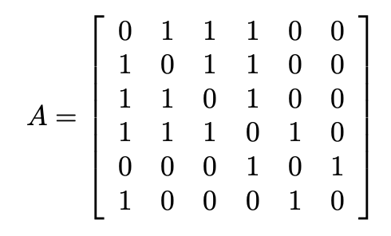

# Adjacency matrix

 

One way to represent a graph $G$ with n vertices numbered from $0$ to $n-1$ is by using an adjacency matrix $A$ of size $n \times n$. Then, the successive rows $i$ and columns $j$ represent their corresponding vertices. The position $A_{ij}$ represents the number of directed edges from vertex $i$ to vertex $j$. Let the following graph serve as an example.

 

 

Then the adjacency matrix $A$ of graph $G$ would look like this.

 

## Functionality

