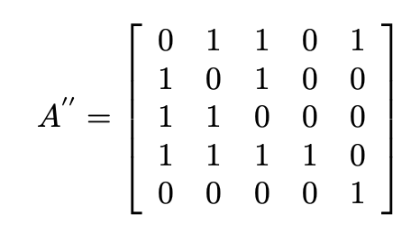

# Adjacency matrix

 

One way to represent a graph $G$ with n vertices numbered from $0$ to $n-1$ is by using an adjacency matrix $A$ of size $n \times n$. Then, the successive rows $i$ and columns $j$ represent their corresponding vertices. The position $A_{ij}$ represents the number of directed edges from vertex $i$ to vertex $j$. Let the following graph serve as an example.

 

 

Then the adjacency matrix $A$ of graph $G$ would look like this.

 

## How to run the project

To run the project, navigate to the `adjacencyMatrix` folder in the console window and use the command `bash start.sh`.

 

## Mathematical interpretation of  operations

### Undirected graph

If the graph is undirected, then $A_{ij} = A_{ji}$.

### Adding a vertex

When adding a vertex, we expand the adjacency matrix $A$ with an additional row and column filled with zeros.

The computational complexity of this operation is very high because it involves allocating all the rows to increase it by one and adding an entire new row in memory.

### Deleting a vertex

To remove a vertex, you need to delete the row and column corresponding to it in the adjacency matrix $A$. In our example, let's remove the vertex with number 3.

Similar to adding a vertex, the computational complexity is very high.

### Adding and removing edges

This is the simplest of operations, as it involves updating the data in the adjacency matrix $A$ in constant time $\mathcal{O}(1)$.

### Calculating the vertex degree

In the case of outgoing degrees, we calculate the sum of the numbers in the row corresponding to the vertex, while in the case of incoming degrees, we calculate the sum of the numbers in the column.

$\text{deg}(0)^{-} = 4$

$\text{deg}(1)^{-} = 3$

$\text{deg}(2)^{-} = 3$

$\text{deg}(3)^{-} = 4$

$\text{deg}(4)^{-} = 2$

$\text{deg}(5)^{-} = 2$

$\text{deg}(0)^{+} = 4$

$\text{deg}(1)^{+} = 3$

$\text{deg}(2)^{+} = 3$

$\text{deg}(3)^{+} = 4$

$\text{deg}(4)^{+} = 2$

$\text{deg}(5)^{+} = 2$

As shown in the above example, the outgoing and incoming degrees for a given vertex in an undirected graph are identical.

The computational complexity of this operation is $\mathcal{O}(n)$.

