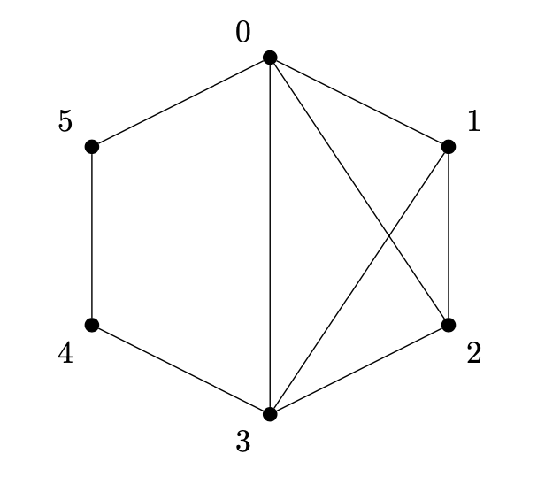

# Searching for a subgraph that is a triangle

 

A **cycle** is a graph in which each vertex has a degree of two. A cycle with $n$ vertices is denoted as $C_n$. On the other hand, a **triangle** is referred to as cycle $C_3," which is a cycle containing three vertices.

 

## Problem description

The goal is to find a triangle $C_3$ in the graph $G$. For the given graph, potential cycles could be the paths:

* $0 \rightarrow 1 \rightarrow 2 \rightarrow 0$,
* $1 \rightarrow 2 \rightarrow 3 \rightarrow 1$,
* $0 \rightarrow 2 \rightarrow 3 \rightarrow 0$,
* $0 \rightarrow 1 \rightarrow 3 \rightarrow 0$.

One of the methods is to utilize the adjacency matrix raised to the power of $k$. In this case, $A^{k}_{ij} = x$ signifies that there are $x$ distinct paths of length $k$ between vertex $i$ and vertex $j$.

